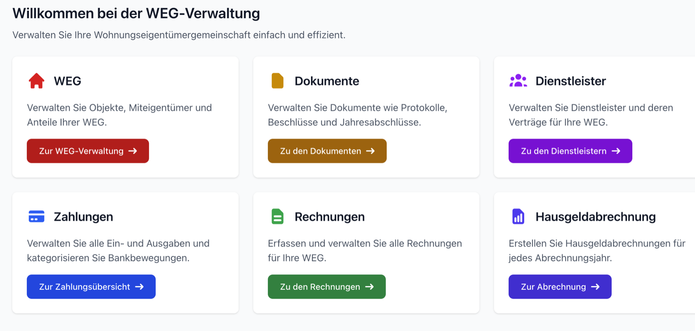
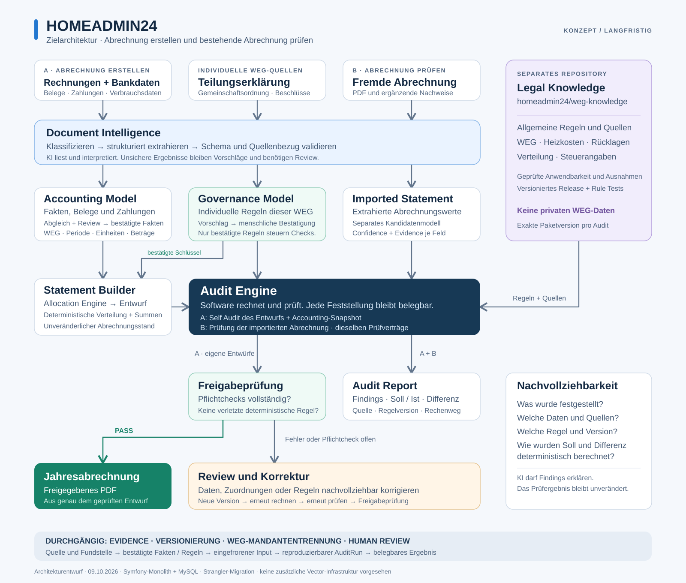

# homeadmin24 - WEG-Verwaltungssystem

[Demo öffnen](https://demo.homeadmin24.de) · [Lokales Setup](docs/setup-local.md) · [Produktions-Setup](docs/setup-production.md)

Umfassendes Immobilienverwaltungssystem für deutsche Wohnungseigentümergemeinschaften (WEG).

## ✨ Funktionen

- Immobilienverwaltung: WEGs, Eigentumseinheiten, Stimmrechte und Miteigentumsanteile
- Finanzverfolgung und Zahlungsverwaltung: Zahlungen, Kostenkonten und Kontostände
- Rechnungsverarbeitung: Dienstleister, Verträge, Fälligkeiten und §35a EStG
- Automatisierte Hausgeldabrechnungen: PDF-Generierung, Eigentümeranteile und Wirtschaftsplan
- CSV-Import: Sparkasse-Import, Auto-Kategorisierung und Duplikaterkennung

## 🧭 Zielarchitektur

Die langfristige Architektur verbindet Dokument Intelligence, Accounting,
WEG-Governance und versioniertes Rechtswissen mit einer gemeinsamen,
deterministischen Audit Engine. KI unterstützt beim Lesen und Erklären;
Berechnungen und Prüfentscheidungen bleiben nachvollziehbar und reproduzierbar.

[Ausführliches Architekturkonzept mit bearbeitbarer Mermaid-Version](docs/architecture/accounting-audit-target.md)

---

## 🛠️ Technischer Stack

- **Backend**: Symfony 8.1 (PHP 8.4+)
- **Frontend**: Node.js 22, Webpack Encore 7, Babel 8
- **Datenbank**: MySQL 9
- **Frontend**: Tailwind CSS, Flowbite, Stimulus.js, Webpack Encore
- **PDF**: Headless Chrome (Puppeteer)

---

## 🤝 Beiträge & Lizenz

Beiträge sind willkommen. Bitte nutze [GitHub Issues](https://github.com/homeadmin24/homeadmin24/issues)
und beachte den [Developer Guide](docs/setup-local.md).

homeadmin24 ist unter der [GNU Affero General Public License v3.0](LICENSE)
lizenziert. Das bedeutet:
- ✅ Freie Nutzung, Änderung und Verteilung
- ✅ Kommerzielle Nutzung erlaubt (Hosting, Beratung, Support)
- ✅ Transparenz und Community-Beiträge willkommen
- ⚠️ Änderungen müssen unter derselben Lizenz veröffentlicht werden
- ⚠️ Netzwerk-Nutzer haben Anspruch auf den Quellcode (AGPL §13)
