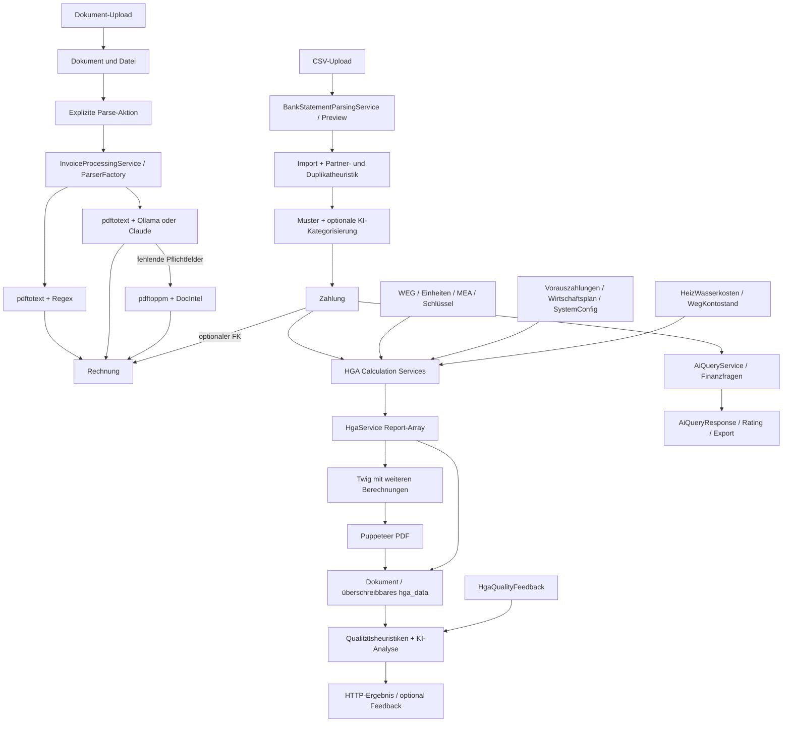

# Accounting, Knowledge und Audit: Bestandsaufnahme

Stand: 2026-10-08. Repository: `homeadmin24/homeadmin24`, untersuchter Commit: `9d9d902afb15d573aafe11c4408ab200cb10a806` (Initial snapshot). Ticket H0.1; ausschließlich Analyse und Dokumentation. ADRs sind **Entwürfe**, keine Implementierungsfreigabe.

## Umfang und Aussagegrenzen

Untersucht wurden alle Entity- und Migrationsdefinitionen, Repository-Abfragen, die relevanten Services, Controller, Commands, Forms, HGA-Templates, Konfiguration, Tests und Deploymentpfade. Der benachbarte DocIntel-Quellcode wurde zur Einordnung der bestehenden Schnittstelle gelesen. Keine privaten PDFs, Bankdateien, Datenbankinhalte, Backups oder lokalen Secrets wurden für Beispiele übernommen. Kein externer KI-Aufruf, keine Migration, kein Deployment, kein neues Repository.

Tabellenaussagen beschreiben ORM und versionierte Migrationen, **nicht** ein verifiziertes Live-Schema. Die HomeAdmin24-Web-/MySQL-Container liefen bei der Prüfung nicht. Installierte lokale Abhängigkeiten und PHP 8.4.4 ermöglichten Offline-Tests. Rechtsbehauptungen in Kommentaren/Prompts wurden als bestehende Implementierung erfasst, nicht rechtlich bestätigt. Quellenprüfung und Lizenzprüfung erfolgen in Phase 1.

Weitere Ergebnisse: [ADR-Index](adr/README.md), [Implementierungsplan Phase 1/2](accounting-audit-phase-1-2-plan.md).

Nachtrag 2026-10-09: Auf Benutzerwunsch wurden vier reale lokale HGA-Previews 2025 als **Git-ignorierte private** Ergebnisbaseline unter `data/private-regression/` gesichert. Dazu wurden lokale Finanzdaten schreibfrei gelesen; sie wurden nicht in diese Dokumentation oder öffentliche Tests übernommen. Capture-/Vergleichsvertrag siehe Ergänzung im Implementierungsplan. Die folgenden Analyse-/Testaussagen beschreiben weiterhin den Stand vom 2026-10-08.

## Wichtigste Ergebnisse

1. Symfony, Doctrine/MySQL, die HGA-Serviceaufteilung, CSV-Leseverfahren und Puppeteer sind wiederverwendbar. Ein Rewrite ist weder erforderlich noch sinnvoll.
2. `Zahlung` ist gleichzeitig Bankbewegung, Kostenbuchung und Kategorisierungsträger. `Rechnung` ist Belegkopf; eine separate wirtschaftliche Buchung fehlt. Zahlungen können bereits mehrfach auf dieselbe Rechnung zeigen, eine Zahlung jedoch nur auf eine Rechnung.
3. Mehrere WEG-Entities bedeuten noch keine Mandantentrennung: Zahlungen/Rechnungen haben keinen direkten WEG-Fremdschlüssel; einige WEG-Repositorymethoden ignorieren ihren WEG-Parameter. User besitzen globale Rollen ohne WEG-Mitgliedschaft.
4. Perioden sind über Jahreszahlen, Zahlungsdaten, Leistungsdaten und JSON-Konfiguration verteilt. Einige Abfragen enden am 30.12., andere am 31.12. Historisierte Eigentümer-, MEA- und Flächendaten fehlen.
5. HGA-Daten existieren als umfangreiches Array und `dokument.hga_data`. Es fehlen unveränderliche Eingabeversionen, fachliche Schema-Versionen, Rule-Versionen und Audit Runs. Neugenerierung kann PDF und JSON überschreiben.
6. Die Qualitätsprüfung enthält feste Heuristiken und KI-Analyse. KI darf den Gesamtstatus hochstufen. Das widerspricht einer ausschließlich deterministischen Entscheidung über Prüfresultate.
7. Extraktionen besitzen keine feldbezogene Evidence. Confidence kann sogar `Rechnung.ausstehend` ändern. Diese Vermischung von Zahlungsstatus und Extraktionssicherheit darf nicht in das neue Modell übernommen werden.
8. Die Qualitätsbaseline ist bereits rot: 8 PHPUnit-Fehler, 120 dateibezogene PHPStan-Meldungen plus 2 Konfigurationsmeldungen, Style-Abweichungen in 11 Dateien. Phase 0 lässt diese unverändert sichtbar.

## Stack und Abhängigkeiten

| Bereich | Bestand / Quelle | Konsequenz |
| --- | --- | --- |
| Runtime | `composer.json`: PHP >=8.4, Symfony 8.1; installiertes Composer-Platform-Check verlangt >=8.4.1 | CI und lokale Runtime vereinheitlichen; kein Frameworkwechsel |
| Persistenz | Doctrine ORM ^3.6.2, DBAL ^4.4.3, Doctrine Migrations; Compose MySQL 9 | Neue Modelle relational und additiv |
| ORM-Erkennung | `config/packages/doctrine.yaml`: nur `src/Entity`, Präfix `App\Entity` | Neue Domain-Verzeichnisse benötigen explizite ORM-Mappings; nicht blind verschieben |
| DI | `config/services.yaml`: Autowiring, HGA-Interface-Aliase, konkrete KI-Dienste | Bestehende Schnittstellen als Übergang nutzen |
| Zweite DI-Datei | `config/services_hga.yaml` enthält teilweise veraltete Argumente; kein expliziter Import in `services.yaml`/`Kernel.php` | Nicht ungeprüft aktivieren, insbesondere Tax-/Distribution-Konstruktoren |
| PDF lesen | Poppler `pdftotext -layout`; `pdftoppm` für Seitenbilder | Extraktion als Adapter behalten, Seitenbezug ergänzen |
| PDF schreiben | `PdfReportGenerator`, Twig, `scripts/render_pdf.js`, Puppeteer/Chromium, Node/Encore | Renderer beibehalten; Rechenlogik schrittweise aus Templates lösen |
| KI | Symfony HttpClient; Ollama, Anthropic, DocIntel | Austauschbare Fähigkeiten statt konkreter Provider-Verzweigungen |
| Asynchronität | Symfony Messenger + Doctrine-Transport | Bestehende Infrastruktur reicht; fachliche Messages fehlen noch |
| Konfiguration | `SystemConfigService`, `system_config`, `wirtschaftsplan_config` | Fachliche Regeln von globaler UI-/Betriebskonfiguration trennen |
| CI | `.github/workflows/deploy-demo.yml`, `deploy-production.yml` | Deployment vorhanden; keine eigenständige Test-/Lint-PR-Pipeline |

## Entities und relevante Tabellen

Entitydateien liegen unter [`src/Entity`](../../src/Entity). Tabellen ohne explizites Mapping folgen der konfigurierten Unterstrich-Namensstrategie.

| Entity / Tabelle | Inhalt und Relationen | Zielbehandlung / Lücke |
| --- | --- | --- |
| `Weg` / `weg` | Bezeichnung, Adresse; 1:n Einheiten | Identität behalten |
| `WegEinheit` / `weg_einheit` | Pflicht-WEG; Nummer, Eigentümername, MEA als String, Hebeanlagenbruch, Mieter/Kontakt | Behalten; Eigentümerhistorie, rationale MEA, Fläche und zeitliche Gültigkeit später ergänzen; Nummer nicht als globale ID behandeln |
| `WegEinheitVorauszahlung` / `weg_einheit_vorauszahlung` | Einheit/Jahr unique; Monatsbetrag, optional Jahresbetrag, aktiv | Als Soll-Datenquelle adaptieren; unterjährige Änderungen fehlen |
| `WegKontostand` / `weg_kontostand` | WEG/Jahr/Kontotyp unique; Anfangs-, Periodenend- und späterer Stichtag mit Salden | Behalten; Kontostand ist kein Reservebewegungsjournal und kein Bankkonto |
| `Zahlung` / `zahlung` | Datum, DECIMAL(10,2), Text, Kategorie, Kostenkonto, Einheit (`eigentuemer`), Rechnung, Dienstleister, Steuer-/Arbeitsanteil, Jahreszuordnung, Simulation, AI-Confidence/-Reasoning, Kontotyp, Zahlungstyp | Legacy erhalten; kein WEG-/Bankkonto-/Quelldokument-FK, keine Importzeile oder externe Transaktions-ID |
| `Rechnung` / `rechnung` | Dienstleister, Nummer, Brutto, MwSt., Leistungs-/Fälligkeitsdatum, Arbeits-/Fahrtkosten, `ausstehend`; 1:n Dokumente | Belegkopf behalten; kein eigenständiges Rechnungsdatum, keine Positionen/WEG/Review-Version |
| `Dokument` / `dokument` | Pfad, Name, MIME, Größe, Kategorie, Uploaddatum, Rechnung/Dienstleister, optionale WEG/Jahr/Einheitsnummer, `hgaData` JSON | Identität/Upload weiterverwenden; Hash, unveränderliche Version, Seite/Feldherkunft fehlen |
| `Dienstleister` / `dienstleister` | Vertragsmetadaten und Preis; Parserklasse/-config/-prompt/-enabled; Dokumente | Weiterverwenden; kein strukturiertes Vertragsregelmodell, kein WEG-Bezug |
| `Kostenkonto` / `kostenkonto` | Nummer, Bezeichnung, KategorisierungsTyp, aktiv, Umlageschlüssel, `taxDeductible` | Katalog adaptieren; keine historisierte WEG-Regel |
| `Zahlungskategorie` / `zahlungskategorie` | Name, Vorzeichen, UI-Felder/Validierungsregeln JSON, Sortierung, Nullbetrag erlaubt | UI- und Importkompatibilität erhalten; kein Rechtswissen |
| `Umlageschluessel` / `umlageschluessel` | Global eindeutiger Code, Bezeichnung, Beschreibung, Gesamtumlage/Typ als Strings | Schlüsselvokabular erhalten; keine Governance-Gültigkeit/Evidence |
| `UmlageschluesselEinheit` / `umlageschluessel_einheit` | Schlüssel + Einheit + Anteil als String | Bestehende Teilnehmeranteile adaptieren; Entity ohne eigene Repositoryklasse, keine Version/Quellenbestätigung |
| `HeizWasserkosten` / `heiz_wasserkosten` | WEG, optionale Einheit, Jahr, Gesamtmarker, Heiz-/Wasser-/sonstige Kosten | Importierte Ergebnisbeträge behalten; keine Zähler, Verbräuche, Grund-/Verbrauchsanteile oder Evidence |
| `WirtschaftsplanConfig` / `wirtschaftsplan_config` | Global unique Jahr, JSON-Daten, Zeitstempel | Adapter; WEG und Planversion fehlen |
| `SystemConfig` / `system_config` | Global unique Schlüssel, JSON-Wert, Kategorie, aktiv, Zeitstempel | Betriebskonfiguration behalten; fachliche Overrides später ablösen |
| `HgaQualityFeedback` / `hga_quality_feedback` | Dokument, Einheit, Jahr, Provider, AI-Result, Nutzermeldung/Bewertung, umgesetzt | Feedback historisch erhalten; kein AuditFinding/AuditRun |
| `AiQueryResponse` / `ai_query_response` | Frage, Finanzkontext JSON, Antwort, Provider, Laufzeit/Kosten, Rating, Trainingmarker | Private Assistenzhistorie; kein überprüftes Ground Truth |
| `KategorisierungCorrection` / `kategorisierung_correction` | Zahlung, vorgeschlagene/gewählte Kategorie und Konto, Confidence/Begründung, Snapshot und User | Guter Ansatz für späteren Correction Loop; nicht vollständig versioniert oder anonymisiert |
| `User` / `user` | Globale Rollen JSON, Login, aktiv, Namen, Zeitstempel | Authentifizierung behalten; WEG-Zugriffszuordnung fehlt |

`BankkontoTyp` und `KategorisierungsTyp` sind Enums, keine Tabellen. `messenger_messages` ist Transportinfrastruktur. `kategorisierung_pattern_stats` wird von einer Migration angelegt, hat aber keine entsprechende Entity im untersuchten Stand. Historische Tabellen `hausgeldabrechnung`, `monats_saldo`, `role`, `user_role` werden von späteren Migrationen entfernt.

Nicht vorhanden: `AccountingPeriod`, `AccountingEntry`, eigenständige `BankTransaction`/`BankAccount`, generische Evidence, GovernanceRule, KnowledgePackage, AuditRun/AuditFinding, persistiertes versioniertes Statement, ImportedStatement und Benchmark-Datasetmodell.

## Migrationsbestand und Schema-Risiken

| Migration | Zweck / Beobachtung |
| --- | --- |
| `Version20250817_CombinedInitialMigration` | Initialschema inklusive inzwischen entfernter Tabellen, Kategorien und Messenger |
| `Version20251201120000_AddAiCategorization` | AI-Felder in Zahlung, Correction und Pattern-Stats |
| `Version20251201180000_AddAiQueryResponse` | Frage-/Antwortspeicherung |
| `Version20251229_AddHgaQualityChecks` | `dokument.hga_data` und Feedback |
| `Version20260115_AddZahlungTypeAndBankkonto` | Zahlungs-/Kontotyp in Zahlung |
| `Version20260120_RemoveMonatsSaldo` | Entfernt Monatssalden |
| `Version20260121_AddUmlageschluesselFields` | Gesamtumlage und Umlagetyp |
| `Version20260122_CreateWegKontostand` | WEG-Jahressalden mit Kontotyp |
| `Version20260123_CreateWirtschaftsplanConfig` | Globale Jahres-JSON-Konfiguration |
| `Version20260215_MergeKontostandStichtag` | Überträgt Stichtagsdaten per Join, löscht `_stichtag`-Zeilen; verwaiste Varianten müssen vor Wiederholung geprüft werden |
| `Version20260216_DropHausgeldabrechnung` | Entfernt Tabelle mit Hinweis auf `dokument.hga_data`; enthält selbst keine Datenkopie. `down()` rekonstruiert Schema, keine ursprünglichen Datensätze |
| `Version20260216_SimplifyRolesAndUserMgmt` | Überträgt Rollen nach JSON, entfernt Rollentabellen/last_login; Down-Migration stellt nicht die ursprünglichen Rollenbeziehungen wieder her |

Konkrete statische Lücken: In den Migrationen findet sich kein `CREATE TABLE umlageschluessel_einheit`, kein `weg_einheit.mieter` und keine Anpassung von `rechnung.information` an das heutige nullable TEXT-Mapping. Das ist ein belegter Unterschied zwischen Versionshistorie und ORM, noch kein Nachweis über den Zustand einer installierten Datenbank.

Lokales Setup und aktive Demo-/Produktionsdeployskripte verwenden `doctrine:schema:update --force`; andere Skripte `doctrine:migrations:migrate`. Dadurch können Umgebungen jenseits der Migrationshistorie entstanden sein. Vor neuen Migrationen: leeres MySQL-Testschema und synthetische Alt-Schemavarianten vergleichen, anschließend einen rein lesenden Schema-/Migrationsstatus je Zielumgebung erheben. Historische Migrationen nicht nachträglich umschreiben oder pauschal erneut ausführen.

## Services, Berechnung und Konfiguration

### HGA

| Komponente | Tatsächliche Aufgabe | Wiederverwendung / Risiko |
| --- | --- | --- |
| `HgaService` | Orchestriert Kosten, Zahlungen, externe Kosten, Steueranteile, Vermögen, Wirtschaftsplan und Report-Array | Öffentliche Fassade behalten; 1.085 Zeilen, fachliche Rechnung/Präsentation/Konfiguration eng verbunden |
| `CostCalculationService` | Gruppiert Zahlungen nach Kostenkonto/KategorisierungsTyp, verteilt Kosten und Rücklagenzuführung | Fachliche Beispiele für neue Engine; Float, Vorzeichenbehandlung, globale Abfragen und Fallback-Schlüssel absichern |
| `DistributionService` | `05*` MEA; `03*` gleiche Einheiten; `02*` DB-Anteile; `06*` Hebeanlagenbruch; `04*` vorgefilterter Festbetrag; `01*` extern | Adapter behalten; keine reine Funktion, da SQL/Repositoryzugriff. Fehlende externe/Anteil-Daten können 0 ergeben |
| `PaymentCalculationService` | Soll/Ist, Zahlungslisten, WEG-Summen, offene Rechnungen, Vermögensübersichten | Ergebnisse als Referenz; Datums-/Jahreslogiken und Summenquellen vereinheitlichen |
| `TaxCalculationService` | Arbeits-/Fahrtkosten proportional zu Rechnungszahlungen und Schlüssel; `01*` Heiz-/Wasserergebnisquotient | Rechenkern später mit Evidence und exakten Beträgen adaptieren; keine vollständige persönliche Steuerberechnung |
| `ExternalCostService` | Liest fertige Gesamt-/Einheitskosten aus `HeizWasserkosten`; `sonstigeKosten` wird als CO₂-Anteil verwendet | Datenadapter behalten; keine Verbrauchs- oder HeizkostenV-Engine |
| `KontostandCalculationService` | Salden/Stichtage und Bewegungen, Abrechnungs-/Abgrenzungsperioden, Differenzstatus | Adaptieren; Fallback Periodenende 30.12., Float-Toleranz <0,01 und WEG-Abfragen prüfen |
| `BalanceCalculationService` | `getBalanceData()` liefert nur `hasData=false`; monatliche Übersicht leer | Übergangsstub, nicht als implementiertes Rücklagenmodell einplanen |
| `HgaConfiguration` | Vorauszahlungen, Steuerkonten, Texte, Wirtschaftsplan | Interface behalten; Monatsbetrag ×12 statt Nutzung des optional gespeicherten Jahresbetrags; Plan erst aus eigener Tabelle, dann `system_config` |
| `SystemConfigService` | Zugriff auf globale Konfigurationswerte und Wirtschaftsplan-Teile | UI-Texte/Betrieb behalten; keine bestätigte Governance daraus ableiten |
| `PdfReportGenerator` | Report-Array → Twig → Chrome PDF | Behalten; Footer benutzt in `renderWithChrome()` nicht definierte Variable `$data` (auch PHPStan-Befund) |

Maßgebliche Stellen: [`HgaService::calculateFinalTotals`](../../src/Service/Hga/HgaService.php), [`DistributionService`](../../src/Service/Hga/Calculation/DistributionService.php), [`ZahlungRepository`](../../src/Repository/ZahlungRepository.php), [`HgaConfiguration`](../../src/Service/Hga/Configuration/HgaConfiguration.php).

Bestehende Schlussrechnung: Kosten werden aus internen Posten plus externen Heiz-/Wasser- und sonstigen Anteilen zusammengeführt; Rücklagenzuführung wird in `calculateFinalTotals()` nicht addiert. `abrechnungsspitze = Kosten − Soll`, `zahlungsdifferenz = Ist − Soll`, `saldo = Kosten − Ist`. Diese drei Größen bleiben im Ziel getrennt. Das beschreibt den Code, keine Rechtsprüfung der Zusammensetzung von Soll/Kosten.

Geld ist in Entities meist DECIMAL-String, wird in Services überwiegend zu Float. MEA wird mehrfach separat geparst; ohne Bruch wird teilweise ein Nenner 1000 angenommen. Eine zentrale Cent-Rundungs-/Restverteilungspolitik fehlt. `CostCalculationService` behandelt reguläre Kosten als negative Zahlungen und addiert deren Absolutbeträge; positive Erstattungen brauchen deshalb gezielte Charakterisierung. Steueranteile nutzen dieselbe Zahlung-/Rechnungskopplung.

Der PDF-Pfad ist nicht vollständig rechenfrei: z. B. `templates/hga/_eigentuemer_kosten_section.html.twig`, `pdf_report.html.twig` und weitere Teiltemplates berechnen Summen/Salden bzw. Fallbacks. Wirtschaftsplan-/Vermögensdaten werden auch aus JSON-Overrides aufgebaut. Neues Statement muss alle verbindlichen Beträge vor Rendering festlegen.

### Dokumente, Import, Parser und KI

| Pfad | Input → Operation → Output → Validierung → Domainwirkung |
| --- | --- |
| Regex-Rechnung | Dokument der Kategorie `rechnungen` mit Dienstleister/PDF → `pdftotext` → Maaß- oder konfigurierbare Regex-Felder → Pflichtfelder → unpersistierte `Rechnung`; `InvoiceProcessingService` verknüpft/persistiert |
| LLM-Rechnung | PDF-Text → konkret Ollama/Claude → JSON-Array → JSON-Parsing und einzelne Feldprüfungen/Normalisierung → direkte Rechnung; kein versioniertes fachliches Schema |
| DocIntel | PDF → `pdftoppm`-Bilder → HTTP `/api/invoice-extract` → `fields`/Confidence → Arrayprüfung → LLM-Rechnungsadapter; regulärer PHP-Pfad speichert keine OCR-Boxen/Feldherkunft |
| Zahlungskategorisierung | Zahlungsbeschreibung, Partner, Historie/Korrekturen → Muster, dann ggf. Ollama → Kontonummer/Confidence/Reasoning → Konto-Lookup → direkte Zuordnung in `Zahlung`; kein vorgeschlagener Review-Datensatz |
| Finanzassistenz | Frage → `AiQueryService` erstellt DB-Kontext → `AIProviderInterface::answerQuery()` → Freitext → Speicherung als `AiQueryResponse`/Rating; kein Auditvertrag |
| HGA-Qualität | `Dokument.hgaData` + jüngstes Feedback → feste Heuristiken + Ollama/Claude → Checks und AI-Assessment → keine gemeinsame Schema-Validation → KI darf Gesamtstatus hochstufen |

`ParserFactory` priorisiert konfigurierte Klasse, namensgebundenen Maaß-Parser, Regex-Konfiguration, verfügbaren LLM-Fallback. `ParserInterface::parse()` gibt eine Entity zurück; Extraktion und Domänenobjekterzeugung sind damit gekoppelt. `InvoiceProcessingService` prüft Kategorie, Dienstleister, `parserEnabled` und bestehende Rechnung. Upload selbst persistiert zunächst das Dokument; Verarbeitung erfolgt über die Parse-Aktion/Commands.

`LlmParser::createRechnung()` setzt `ausstehend = confidence < 0.7`. Das ist keine Zahlungsprüfung. Confidence/Begründung werden im Informationstext gespeichert, nicht als Feld-Evidence. Die Normalisierung entfernt alle Punkte und ersetzt Komma; bereits dezimale Punktnotation ist deshalb ein gezielt zu testender Fall. Der Maaß-Parser verwendet bei fehlendem Arbeitskostenanteil einen Netto-Fallback. Keinen dieser Fallbacks als bestätigte Evidence übernehmen.

`AIProviderInterface` abstrahiert bislang Finanzfragen, nicht Klassifikation/Extraktion/Erklärung. `DocIntelInterface` ist separat. Flags `AI_ENABLED`, `AI_CLAUDE_ENABLED`, `DOCINTEL_ENABLED` existieren unabhängig. Die Kommentare „nur Entwicklung“ sind keine Laufzeitprüfung; z. B. Claude prüft Flag und Schlüssel. Modellkennung/Kosten stehen bei Claude im Code. Neues Ziel: gemeinsamer Ausschalter plus explizite Provider-/Fähigkeitskonfiguration, versionierte Schemavalidierung vor Domainwirkung.

Bestehender DocIntel ist bereits ein benachbarter Python-Service im Compose, kein neu einzuführender Dienst. `../doc-intel/app.py` enthält PaddleOCR + Regex; LayoutLM-Laden ist vorbereitet, Feldmapping noch Platzhalter. Die README zeigt teilweise einen älteren Placeholder-Response. Bestehenden optionalen Adapter erhalten, keine neue Python-Landschaft daraus ableiten. Nicht gegen reale Dokumente getestet.

CSV: `CsvImportController` lädt hoch, zeigt Preview und stößt `BankStatementParsingService` an. Sparkassenformat mit 17 Spalten, Encoding-Konvertierung, deutsche Datums-/Betragsformate, Partner-Aliase/Fuzzy-Matching, Duplikatheuristik. Import erzeugt `Zahlung` und ggf. Dienstleister, danach Kategorisierung. `all` überspringt die Duplikatvermeidung bewusst. Konto, IBAN, Valuta, Referenzen und Währung werden geparst, jedoch nicht als vollständige unveränderliche Banktransaktion gespeichert. Es fehlt eine FK-Verbindung der Zahlung zur CSV-Zeile. Das ist kein Invoice↔Bank-Matching mit Teilbeträgen, Review und Begründung.

### Bestehende Qualitätsprüfung

`HgaQualityCheckService` prüft u. a. fehlende Heiz-/Wasserkosten, Ist=0, typische Zahlungsanzahl 10–16, Kostenanteil relativ zu MEA, feste Heizkosten-/Steuerschwellen. Das sind überwiegend Plausibilitätsannahmen, keine vollständigen arithmetischen Nachweise. Erwartete JSON-Felder sind teilweise nicht deckungsgleich mit dem Builder: z. B. `costs.total` gegenüber `gesamtkosten` und `tax_deductible.total/tax_reduction` gegenüber `total_anrechenbar`. Fehlende Werte werden häufig als 0 behandelt. Damit ist PASS keine Aussage über Vollständigkeit.

Ergebnis wird über HTTP zurückgegeben; Feedback kann AI-Ergebnis speichern. Kein vollständiges persistiertes Prüfprotokoll mit Engine-, Knowledge-, Rule- und Input-Version. Keine verbindliche Audit-Sperre vor PDF-Erzeugung. Externe Abrechnungen ohne `hgaData` können diesen Pfad nicht nutzen.

## Controller, Commands und Messenger

| Controller | Verantwortung / relevante Schnittstelle |
| --- | --- |
| `DokumentController` | Upload, CRUD, Parse, Download, Quality Check, Debug, Feedback unter `/dokument` |
| `RechnungController`, `DienstleisterController` | Beleg-/Dienstleister-CRUD, Rechnung aus Zahlungsbezug, Dienstleister-Rechnungslookup |
| `CsvImportController` | `/csv-import/upload` und `/import`, Preview und Import |
| `ZahlungController` | Listen, Filter, Kategorisierungs-/Reviewaktionen |
| `ZahlungCreateController`, `ZahlungEditController`, `ZahlungShowController`, `ZahlungDeleteController` | Einzelzahlungs-CRUD |
| `WegController` | WEG/Einheiten, Kostenkonten, Umlageschlüssel, Benutzerverwaltung |
| `AbrechnungController` | `/abrechnung`, Sammelerzeugung, Preview Eigentümer/Mieter, Salden, Wirtschaftsplan-/HGA-/Vermögenskonfiguration |
| `HgaController` | Paralleler `/hga`-Einstieg und Einzelerzeugung; eigene Dokumentspeicherung |
| `Api/AiQueryController` | Ollama/Claude/vergleichende Finanzfragen und Rating unter `/api/ai` |
| `HomeController`, `SecurityController` | Finanzübersicht und Login/Logout |

Mehrere Speicherpfade (`AbrechnungController`, `HgaController`, `HgaGenerateCommand`) müssen beim späteren Statement-Cutover gemeinsam berücksichtigt werden. `AbrechnungController` erzeugt Reportdaten für Rendering und erneut für Speicherung; ohne Snapshot kann zwischen beiden Berechnungen eine andere Datenbasis entstehen. Dateien/`hgaData` werden bei gleichem Dateinamen aktualisiert. Previews suchen Einheiten nach Nummer; tenantgebundene Identität muss im Ziel explizit werden.

| Commands | Aufgabe / Risiko |
| --- | --- |
| `app:hga-generate` | HGA erzeugen und Dokument speichern |
| `app:calc-vorauszahlung` | Vorauszahlungsberechnung; zusätzlich `scripts/calc_vorauszahlung.php` |
| `app:configure-parser`, `app:test-parser` | Parserkonfiguration bzw. Parserausführung; kein gewöhnlicher Offline-Test |
| `app:test-ai`, `app:test-ai-query` | Provider-/Fragetests, können externe Aufrufe auslösen |
| `app:ai:export-training-data` | Bewertete Claude-Antworten als JSONL/CSV, optional als genutzt markieren; keine belastbare Anonymisierung oder Ground-Truth-Garantie |
| `app:check-kostenkonto`, `app:analyze-kostenkonto-filter`, `app:analyze-zahlungskategorie` | Bestandsdiagnostik |
| `app:fix-kostenkonto-filter`, `app:update-kostenkonto-filter`, `app:remove-inactive-kostenkonto-from-filters`, `app:deactivate-unused-kostenkonto` | Stammdaten-/Filterpflege mit Schreibwirkung |
| `app:create-admin`, `app:hash-password` | Benutzer-/Passwortwerkzeuge |

Keiner dieser fachlich schreibenden oder Provider-Commands wurde in Phase 0 ausgeführt.

Messenger: `config/packages/messenger.yaml` konfiguriert `async`, `failed`, Retry max. 3/Multiplikator 2 sowie Routing für Mailer-/Notifier-Nachrichten. Keine eigenen `App\Message`/Handler und kein fachliches Dispatching in den untersuchten Pfaden. Dokumentverarbeitung läuft synchron. Neue Messages sollen IDs, WEG und Input-Version tragen; keine Dokumentinhalte im Queue-Payload. Worker-Konfiguration und MySQL-Transportoptionen sind vor Nutzung zu prüfen, nicht als funktionierender Document-Workflow vorauszusetzen.

## Aktueller Datenfluss

Es gibt aktuell keine verpflichtende Kante „Audit bestanden → PDF“, keine Governance-Registry und keinen Knowledge-Import.

## Konflikte mit dem Masterplan und Risiken

| Priorität | Beleg / Konflikt | Konsequenz für Migration |
| --- | --- | --- |
| P0 | `ZahlungRepository::getPaymentsByWegAndYear()` ignoriert WEG; `findByWegAndDateRange()` nimmt alle eigentümerlosen Zahlungen hinzu; WEG-Level-Einnahmen ebenfalls global | Neue Reads strikt WEG-gebunden; unklare Altzuordnungen blockieren, nie an alle WEGs verteilen |
| P0 | User ohne WEG-Mitgliedschaft, Rollen statt Objektberechtigung; `wirtschaftsplan_config` global pro Jahr | Mandantenzugriff als Voraussetzung produktiver neuer Funktionen, Negativtests über zwei WEGs |
| P0 | Kein einheitlicher Periodenbegriff; 30.12.-Abfragen neben 31.12. und manueller Jahreszuordnung | Zahlungsdatum, Leistungszeitraum, Berichtsperiode und Saldenstichtag getrennt modellieren; keine stille „Bereinigung“ alter Ergebnisse |
| P0 | LLM-Confidence setzt Rechnungsstatus; Kategorisierung schreibt direkt | Review-Status unabhängig vom Zahlungsstatus; Altwerte nicht automatisch `confirmed` |
| P1 | Teilweise Float-/Twig-Rechnungen, Null→0-Fallbacks, nicht versionierte Schwellen | Exakte Money-/Ratio-Verträge, „nicht prüfbar“ statt falschem PASS, Tests mit bekannten Sollwerten |
| P1 | Überschreibbare PDF/JSON, doppelte Reportberechnung | Ein Snapshot → Audit → Rendering; unveränderliche Versionen |
| P1 | Migration/ORM-Drift und Schema-Update-Deployments | Reproduzierbare Baseline vor additiven Migrationen; getestetes Upgrade statt Schema-Update als Backfill |
| P1 | Kein allgemeines Evidence-/Review-/Governance-Modell | Bezüge ergänzen, historische fehlende Quelle ausdrücklich kennzeichnen |
| P1 | `runAIAnalysis()` loggt vollständigen Prompt; CSV-Import loggt Partner/Betrag; Provider können fehlerhafte Antworten loggen | Datenschutz-/Loggingkorrekturen getrennt planen; keine Logs als öffentliche Fixtures verwenden |
| P1 | Quality-/DocIntel-Debug-GET kann Provideraufrufe starten; Quality-POST ohne lokale CSRF-Prüfung; CSV-Pfad aus Request-Dateiname | HTTP-/CSRF-/Pfad-/WEG-Prüfungen in eigenem Hardening-Ticket; reine Codebefunde, kein Exploitversuch |
| P1 | `/hga`, `/csv-import`, `/api/ai` fallen überwiegend auf globale Rollenregeln zurück | Schreib-/Export-/Providerberechtigungen explizit prüfen; Login allein ist keine Mandantentrennung |
| P2 | Optionaler DocIntel und Ollama bereits vorhanden; Masterplan will keine neue Infrastruktur | Adapter erhalten, optional lassen; Ausbau nur anhand späterer Benchmarks |
| P2 | Trainingsexport und Few-Shot-Feedback bereits vorhanden | Historie privat behalten; weder automatische Veröffentlichung noch Fine-Tuning-Ausbau vor Ground Truth |

Uploads haben bereits Symfony-File-Validierung (10M/MIME) bzw. CSV-MIME-Prüfung und CSRF für Upload/Import. Diese Kontrollen weiterverwenden, um tenantgebundene Zugriffe, sichere Pfadauflösung, Ressourcenlimits und explizite Providerfreigabe ergänzen. Private Bestandsdaten wurden nicht auf tatsächliche Leaks untersucht; keine Aussage über Vorfälle.

## Behalten, adaptieren, später ersetzen

| Entscheidung | Komponenten |
| --- | --- |
| Behalten | Symfony-Monolith, MySQL/Doctrine, Messenger, WEG-/Einheitsidentitäten, Rechnungen/Dokumente/Dienstleister, Kostenkatalog, Poppler, Puppeteer/Twig-Layout, Authentifizierung |
| Adaptieren | CSV-Parser als Raw-Importadapter; bestehende Invoice-Parser als Canonical-Adapter; HGA-Fassade/Services als Legacy-Leser; Vorauszahlungen/Salden/externe Kosten als explizit versionierte Inputs; bestehende Provider als optionale Fähigkeiten; Feedback als private Korrekturhistorie |
| Schrittweise ersetzen | Direkte LLM→Entity-Writes, `ausstehend`-Confidence-Kopplung, globale Finanzabfragen, mutable Regel-/Plan-JSON als Authority, Float-/Templateberechnungen, überschreibbare Statement-Speicherung, AI-gesteuerter Auditstatus, Balance-Stub |

Ersatz erst nach Vergleichstests, überprüften Abweichungen, produktiver Nutzung und separat freigegebenem Rückbau. Es werden jetzt keine Ordner verschoben oder Funktionen entfernt.

## Zielmodell und Migrationsvorschlag

Phase 2 ergänzt `AccountingPeriod`, `AccountingEntry`, `EvidenceReference` mit unveränderlicher `DocumentVersion`, `BankAccount`, `BankTransaction`, `AccountingEntryInvoiceLink` und `AccountingEntryPaymentAllocation`. Die letzte Relation trägt den zugeordneten Betrag und Reviewstatus; sie ersetzt keine alten FK-Beziehungen. Ein reiner Many-to-many-Join ohne Teilbetrag reicht für Sammel-/Teilzahlungen nicht.

`LegacySourceMapping` hält Quelltyp/-ID/-Version, explizite WEG-Zuordnung und das neue Ziel für wiederholbaren Import. `AccountingEntryRevision` hält Änderungen bestätigter Fakten fest. Alle tenantgebundenen Referenzen müssen dieselbe WEG haben. Unzuordenbare Datensätze bleiben im Legacy-Bestand und erscheinen im privaten Importbericht.

Spätere Phasen ergänzen zeitabhängige Eigentümer-/MEA-/Flächendaten, GovernanceRule/Revision/Review, KnowledgePackage, AuditRun/Finding/RuleEvaluation, StatementVersion und ImportedStatementCandidate. Fachliche Statuswerte und genaue FK-/Indexverträge stehen in den ADRs und im Ticketplan.

Migration: additive Tabellen → synthetische Tests → explizit zugeordneter, idempotenter Backfill mit Dry-run → Vergleich neuer Lesemodelle mit Legacy → Unterschiede fachlich freigeben → gezielte Umschaltung je WEG/Periode. Legacy bleibt bis dahin führend für bisherige HGA. Keine doppelte Zählung von Rechnung plus Zahlung; Bankbewegung, wirtschaftlicher Vorgang und dessen Settlement sind getrennte Fakten. Rückfall über Feature-Flag/Legacy-Reads, nicht über destruktives Löschen neuer Daten.

## Tests und tatsächlicher Prüfstatus

Unveränderter Bestand, geprüft am 2026-10-08:

| Prüfung | Ergebnis |
| --- | --- |
| Standard-`php` | PHP 8.3.20; Composer stoppt wegen >=8.4.1 vor Testbeginn |
| PHP 8.4.4 + `vendor/bin/phpunit --do-not-cache-result` | 13 Tests, 13 Assertions, 8 Errors, Exit 2. Alle 8 in `DistributionServiceTest::setUp()`: ein Konstruktorargument statt zwei |
| PHPStan Level 6, Repositorykonfiguration, 512M | Exit 1; 120 dateibezogene Meldungen plus 2 nicht mehr passende Ignore-Patterns |
| PHP-CS-Fixer, Repositorykonfiguration, `--dry-run --using-cache=no --format=json` | Exit 8; 11 Dateien mit Style-Abweichungen; nichts formatiert |
| Live-Schema, DB-Integration, Migrationen, Browser/PDF, Provider | Nicht ausgeführt; kein laufendes HomeAdmin24-MySQL/Web, keine Produktions-/Privatdaten verwendet |

Die Parallelisierungs-Sockets von PHPStan/CS-Fixer wurden zunächst von der Sandbox blockiert; beide Checks danach mit zugelassener lokaler Ausführung abgeschlossen. Keine Dependency-Updates.

Testinventar: `DistributionServiceTest` (6 Datensätze + 2 Validierungsfälle), `HgaServiceTest` (4 gemockte Validierungsfälle), `PHPStanFixTest` (1 diagnostischer Test). Letzterer akzeptiert nichtleere Ausgabe auch bei Analysefehlern und ist kein Quality Gate. Die `02*`-Erwartung im Distributionstest beschreibt noch einen älteren externen Wasserpfad; heute liest der Service DB-Anteile. Ein bloßes Ergänzen des fehlenden Mocks genügt als fachliche Charakterisierung nicht.

`tests/ai/test-claude.php`, `test-ollama-direct.php`, `test-quality-check.php`, `test-ai-providers.sh` sind manuelle Provider-/Smoke-Skripte und wurden nicht gestartet. Es fehlen reguläre DB-/Mandanten-/Import-/Migrationstests, Parser-Golden-Tests, Rundungs-/Teilzahlungsfälle, deterministische Auditfälle und Benchmarks. Vor Phase-2-Produktivnutzung müssen diese gezielt aufgebaut werden.

H0.1-Acceptance „bestehende Tests unverändert grün“ ist damit **nicht erfüllt**, weil der untersuchte Ausgangsstand bereits fehlschlägt. Tests und Produktionscode wurden gemäß Phase-0-Auftrag nicht repariert. Dokumentationsumfang ist fertig; technische Freigabe bleibt an die explizit geplante Baseline-Reparatur gebunden.

## Offene Architekturentscheidungen zur Freigabe

1. WEG-Zugriffsmodell: User↔WEG-Mitgliedschaft mit Rollen oder explizit zugeordnete Administration aller WEGs; keine implizite globale Berechtigung.
2. Fachlicher Umgang mit Altperiodenende 30.12., manuellen Jahreszuordnungen, Saldenstichtagen und Soll-Vorauszahlungen. Empfehlung: historische Semantik dokumentieren, neue Perioden explizit, Abweichungen separat entscheiden.
3. Exakte Geld-/Bruchdarstellung und Rundungsregel. Empfehlung: EUR-Minor-Units im Rechenkern, rationale Anteile, deterministische Restcentverteilung; fachliche Freigabe vor Engine-Cutover.
4. Kleinste fachliche Einheit eines AccountingEntry: Empfehlung eine Kosten-/Ertrags-/Transferposition mit einer Kategorie; gemischte Rechnungen aufteilen, Beleg und Zahlung separat referenzieren.
5. Lizenz des neuen Knowledge-Repos: Empfehlung eigener Code/Schemas unter MIT, eigene redaktionelle Regeltexte/Metadaten unter CC BY 4.0; Drittquellen separat nach bestätigten Rechten. Noch keine Lizenz beschlossen.
6. Reviewzuständigkeit und Freigabekriterien für Rechtsregeln; Vorrang nicht einfach durch numerische Governance-Priorität gegenüber zwingendem Recht bestimmen.
7. Umfang von Phase 2: vorgeschlagene minimale Bank-/Document-Version-/Tenant-Unterstützung als Voraussetzung der vier Mastertickets; produktiven Backfill erst nach Zuordnungsprüfung aktivieren.

Phase 1 und Phase 2 werden erst nach Freigabe des Plans implementiert.
