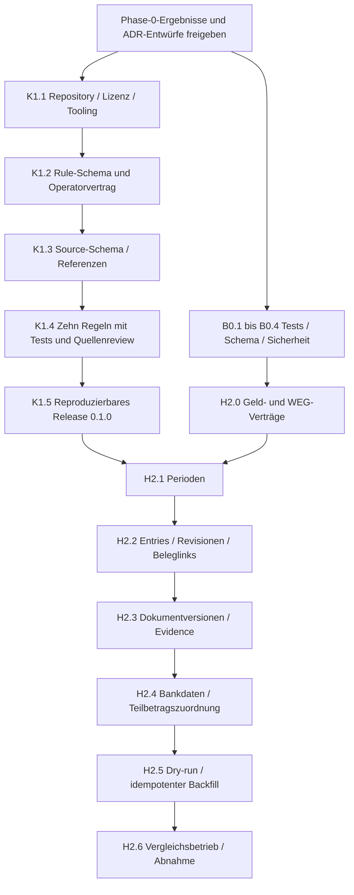

# Implementierungsplan Phase 1 und Phase 2

Stand: 2026-10-08. **Vorschlag zur Freigabe; nicht begonnen.** Grundlage: [Bestandsaufnahme](accounting-audit-current-state.md) und [sieben ADR-Entwürfe](adr/README.md). Jedes unten genannte Ticket ist ein eigener kleiner PR-/Commit-Kandidat. Phase 3–14 wird hier nur über Schnittstellen vorbereitet.

Langfristiges Zielbild: [Architekturzeichnung mit beiden Workflows](accounting-audit-target.md) · [SVG](accounting-audit-target.svg). Die Zeichnung zeigt insbesondere den Self Audit vor der PDF-Freigabe.

## Liefergrenzen

Phase 1 liefert ein eigenständiges Knowledge-Repository mit validierten Regeln und Release 0.1.0. Phase 2 liefert ein additives Accounting-Grundmodell einschließlich belastbarer Evidence und Teilzahlungsrelationen. Bestehende HGA bleibt produktiver Pfad. Keine neue Audit-UI, Governance-Extraktion, Statement-Engine, Fremd-PDF-Extraktion, RAG oder Modelltraining in diesen Phasen.

Der Masterplan nennt vier Phase-2-Haupttickets. Deren Umsetzung wird kleinteilig geschnitten; Bank-/Dokumentversionen und WEG-Zuordnung sind unterstützende Voraussetzungen, keine neue Infrastruktur. Produktiv-Backfill ist eine gesonderte Aktivierung nach synthetischem Nachweis und geprüfter privater Zuordnung.

## Ergänzung 2026-10-09: Private HGA-Ergebnisbaseline

Auf ausdrücklichen Benutzerwunsch wurden die lokalen Eigentümer-Previews für 2025, Einheiten `0001`, `0002`, `0003`, `0004`, als private Vergleichsfixtures gesichert. Ziel: dieselben Ergebnisse nach der schrittweisen Migration, ohne stillschweigende fachliche Änderungen. Dies ergänzt Phase 0; es startet keine Phase-1/2-Implementierung.

Lokaler Speicherort: `data/private-regression/hga-2025-baseline-20261009/`. Anleitung und lokale Hilfsskripte liegen unter `data/private-regression/`. Der gesamte Pfad fällt unter die bestehende Git-Ignore-Regel `data/`; Fixtures einschließlich PDFs, JSON und Eingabedaten dürfen nicht committed oder mit `git add -f` hinzugefügt werden. Der Plan enthält nur diese Referenz und keine Finanz-/Personendaten. Eine Sicherung außerhalb dieses Rechners muss ebenfalls privat erfolgen.

Gesichert je Einheit: Preview-HTML, PDF, strukturiertes Berechnungsergebnis, Tabellenzellen und sichtbarer Text. Ein privater Input-Snapshot hält die zugrunde liegenden Finanzdatensätze fest; Manifest und Hashes dokumentieren Zeitpunkt, Quellcode, URLs und Integrität. Die loginpflichtigen URLs wurden über den bestehenden lokalen Preview-Controller gerendert, dessen Ausgabe gegen dieselben HgaService-/Twig-Ergebnisse geprüft wurde. Keine Änderung von Authentifizierung, Produktionslogik oder Datenbank. Der Input-Snapshot ist kein vollständiges DB-Backup; spätere Replay-Tests benötigen einen expliziten Import in eine isolierte lokale Testdatenbank.

Verbindliche zusätzliche Abnahme für H2.6 und später H9.1–H9.3:

- Alle vier Einheiten müssen mit denselben eingefrorenen Eingaben dieselben Kostenpositionen, Beträge, Schlüssel/Anteile, Vorauszahlungen, Abrechnungsspitzen, Salden, Steueranteile, Rücklagen-/Vermögens- und Wirtschaftsplanangaben liefern.
- Vergleich auf strukturierten Werten **und** allen sichtbaren Tabellen/Texten; PDF dient zusätzlich der Sichtprüfung. Änderungen am neuen Datenmodell werden durch einen Vergleichsadapter auf den gespeicherten Outputvertrag abgebildet.
- Nur Erstellungsdatum und technischer Berechnungszeitpunkt werden normalisiert. Geschäftsdaten, Beträge und Rundungen erhalten keine pauschale Toleranz. PDF-Bytes können wegen Metadaten variieren und sind kein fachliches Gleichheitskriterium.
- Geänderte Eingaben sind kein gültiger Nachweis gleicher Ergebnisse. Die unveränderte Baseline wird niemals automatisch überschrieben; Vergleichskandidaten landen in neuen Verzeichnissen.
- Abweichungen blockieren die Umschaltung, bis Ursache und Änderung ausdrücklich geprüft/akzeptiert sind. Bekannte Bestandsfehler werden nicht durch Aktualisieren der Goldens verdeckt; rechtliche/mathematische Korrektheit und Legacy-Parität sind getrennte Nachweise.
- Private Fixtures ergänzen synthetische CI-Tests ausschließlich lokal. Kein Upload ins Knowledge-Repository, keine öffentlichen CI-Artefakte und keine Providerweitergabe.

Lokaler Integritätscheck: `node data/private-regression/compare-hga.cjs hga-2025-baseline-20261009`. Vergleich nach neuem Capture: denselben Aufruf um den Kandidatenverzeichnisnamen ergänzen. Die private README beschreibt Capture und Vergleich; die Hilfsskripte sind ebenfalls Git-ignoriert.

Verifiziert am 2026-10-09: unabhängiger zweiter Capture `hga-2025-verification-20261009` stimmt für alle vier Einheiten bei Inputs, strukturierten Reports, Tabellen und sichtbaren Texten überein. Alle SHA-256-Prüfungen bestanden; vier PDFs mit jeweils neun Seiten erstellt. Private Artefakte sind untracked und durch Git ignoriert. Dieser Test belegt die reproduzierbare Ausgangsbaseline, noch keine Parität einer zukünftigen Implementierung.

## Reihenfolge und Abhängigkeiten

Die zwei Zweige kennzeichnen fachliche Unabhängigkeit, keine Aufforderung zu Agentendelegation. Ohne weitere Priorisierung: zuerst Knowledge-Fundament, anschließend Baseline-Voraussetzungen und Phase 2 in obiger Reihenfolge. Baselinearbeiten können nach Freigabe auch vorgezogen werden.

## Gemeinsame Definition of Done

Für jedes Implementierungsticket gelten: begrenzter Diff, Tests mit unabhängigen Sollwerten, Offline-CI, Lint/Static Analysis grün, aktualisierte Dokumentation, Security-/Tenant-Review, keine Secrets oder echten WEG-/Bank-/Dokumentdaten, bestätigte Rückwärtskompatibilität. Bei Schemaänderungen zusätzlich leeres Schema und Upgrade aus synthetischem Vorzustand testen, SQL prüfen, Datenzählungen/Summen vergleichen und Rückfall dokumentieren. Keine pauschalen `schema:update --force`-Deployments für neue fachliche Datenmigrationen.

Nicht passende Gates werden ausdrücklich als nicht anwendbar dokumentiert (Knowledge-Regelticket braucht keine DB-Migration). Die rote Ausgangsbaseline ist keine Ausnahme vom Qualitätsziel: erforderliche Reparaturen stehen unten separat, keine versteckte Baseline-Unterdrückung. Produktionskorrekturen werden nicht in ein Entity-/Schema-Ticket gemischt.

## Voraussetzungen im HomeAdmin24-Repository

### B0.1a – Bestehende HGA-Unit-Tests aktualisieren

- Scope: `DistributionServiceTest` an aktuellen Konstruktor/DB-Anteilspfad anpassen; bestehende vier HGA-Validierungsfälle erhalten. Keine Änderung der Berechnungslogik.
- Tests: SQL-Resultate für `02*`, `06*`-Brüche, `04*`-Voraussetzung, ungültige Nenner und fehlende Anteile getrennt charakterisieren. Feste erwartete Werte statt Implementierung nachrechnen.
- Acceptance: gesamte PHPUnit-Suite tatsächlich grün; Test bestätigt aktuelle Semantik, benennt verbleibende fachliche Defizite. Keine Provider-/DB-Aufrufe in Unit-Tests.
- Abhängigkeit: Freigabe; keine Migration. Commit: `test(hga): restore calculation test baseline`.

### B0.1b – Ehrliche Quality Gates und Analysebaseline

- Scope: diagnostischen `PHPStanFixTest` aus der Rolle eines vermeintlichen Gates lösen; eigenständige PR-CI mit PHP >=8.4.1, PHPUnit, PHPStan und Style-Check. Keine Deploymentausführung durch Testjobs.
- Die 120 dateibezogenen PHPStan-Meldungen und zwei veralteten Ignore-Patterns nach Fehlerklasse in kleine Folge-PRs schneiden. Zuerst echte Vertragsfehler (z. B. nicht definierter PDF-Footer-Input), dann Annotationen und Style in separaten PRs. Keine breit wirkenden neuen Ignore-Regeln.
- Acceptance: CI schlägt bei absichtlich fehlerhaftem Test/Analyseexit fehl; alle Gates grün vor H2-Integration. Styleänderungen getrennt von Logikfixes.
- Migration: keine. Abhängigkeit: B0.1a für abschließende Gesamtbaseline.

### B0.2 – Reproduzierbare Migrationsbaseline

- Scope: versionierte Migrationen gegen aktuelles ORM vergleichen; fehlende `umlageschluessel_einheit`, `weg_einheit.mieter`, `rechnung.information` und weitere tatsächlich bestätigte Abweichungen in neuen, expliziten Korrekturmigrationen behandeln.
- Tests: leeres MySQL-Testschema, aus Migrationen entstandener Vorzustand und synthetische bereits per Schema-Update ergänzte Installation. Vorhandene Daten/IDs erhalten; keine erneute historische Drop-/Merge-Ausführung.
- Acceptance: dokumentierter Upgradepfad und Schema-Validierung; schreibfreie Bestandsprüfung und erforderliche Preflightbedingungen; Schema-Update vs. Migrationsdeploy in eigenem kleinen Folge-PR vereinheitlichen.
- Abhängigkeit: B0.1; reale Schema-/Migrationsmetadaten später lesend prüfen. Produktionsdaten bleiben außerhalb Fixtures.

### B0.3 – WEG-Zuordnung und Zugriffskontrakt

- Scope: User↔WEG-Berechtigungsmodell entscheiden und minimal umsetzen, explizite tenantgebundene Repository-/Command-Verträge und Lookup nach WEG+Einheits-ID. Globaler Kostenkatalog bleibt von WEG-spezifischer Regelanwendung getrennt.
- Tests: zwei synthetische WEGs mit gleicher Einheitsnummer, gleichem Lieferanten und gleichen Beträgen; Listen, Einzelzugriff, Download, Preview, Import, CLI, Evidence und spätere Links dürfen nicht übergreifen.
- Acceptance: keine implizite WEG aus erstem Datensatz/Jahr/Dienstleister; unzuordenbare Altzahlung blockiert neuen Import. Produktive neue Datenpfade vor erfolgreichem Negativtest gesperrt.
- Schema: ggf. additive Mitgliedschaft und explizite Legacy-Zuordnungen, eigener Migrations-PR. Abhängigkeit: B0.2 und Entscheidung des Zugriffsmodells.

### B0.4 – Begrenztes Import-/Provider-Hardening

- Scope: konkrete Bestandsbefunde separat beheben: Pfadbindung bei CSV-Dateinamen, angemessene Schreib-/Debug-/Providerrollen und CSRF, keine sensitiven Vollprompts/Bankdaten im normalen Log, keine netzwirksamen Debug-GETs. Gemeinsamen AI-Off-Vertrag vorbereiten, ohne neue Provider einzuführen.
- Tests: ungültige Pfade, fremde WEG, fehlender CSRF, ausgeschaltete AI mit HttpClient-Fake ohne Requests, erlaubter manueller Import weiterhin möglich.
- Acceptance: betroffene vorhandene Flows funktionieren, keine stillen externen Fallbacks. Kein Live-Provider-Test.
- Abhängigkeit: B0.3; einzelne Fix-PRs statt Sicherheits-Megacommit. Keine Änderung der Berechnungssemantik.

## Phase 1 – weg-knowledge

### K1.1a – Repo, Lizenzentscheidung und Beitragsvertrag

- Lieferumfang: `homeadmin24/weg-knowledge`, README, LICENSE/ggf. NOTICE, CONTRIBUTING, SECURITY, CHANGELOG, Versionsdatei und gewünschte Verzeichnisstruktur.
- Lizenzentscheidung: Vorschlag aus ADR 0005 bestätigen oder ändern; Eigentexte/Code und Drittquellen getrennt kennzeichnen. Öffentlich/private Sichtbarkeit des neuen Repos vor Erstellung festlegen. Keine Drittquellentexte importieren.
- Acceptance: Scope/Non-Goals, synthetische Fixtures, Reviewverantwortung, Meldeweg für Sicherheitsprobleme und Releasekonvention dokumentiert. Neues Repo enthält keine App-/Kundendaten.
- Tests: Struktur-/Metadatentest; Migration nicht anwendbar. Commit: `chore(knowledge): establish repository and contribution policy`.

### K1.1b – Offline-Validierungswerkzeuge und CI

- Lieferumfang: kleine CLI `validate`, `test`, `build`; gepinnte Dependencies/Lockfile. Bevorzugt PHP-CLI mit YAML-Reader und gepflegtem JSON-Schema-Validator, sofern der Draft-2020-12-Probetest alle verwendeten Features unterstützt. Werkzeugentscheidung dokumentieren, kein Laufzeitservice.
- Tests: erfolgreiche und fehlerhafte Beispieldatei; keine Netzreferenzen/Custom-YAML-Tags; doppelte YAML-Schlüssel ablehnen. CI auf Push/PR, ohne Provider-/Web-Abhängigkeit nach Dependency-Installation.
- Acceptance: fehlerhafte Fixtures führen zu nichtnull Exit; Releasejob läuft nur auf passenden Tags und mit minimalen Permissions. Keine generierten Artefakte überschreiben fremde Dateien.
- Abhängigkeit: K1.1a. Commit: `build(knowledge): add offline validation pipeline`.

### K1.2a – Rule-Schema v1

- Lieferumfang: JSON Schema für alle Masterplan-Pflichtfelder; eindeutig `expected_behavior`; optionale Beispiele, Ausnahmen, maschinenprüfbare Parameter. `valid_to` explizit nullable; Regeln mit unklarem Rechtsstand als Reviewbedarf statt erfundenem Datum.
- Tests: fehlende Pflichtfelder/Versionen, falsche Typen/Enums/Datumswerte, ungültige Intervalle, unerwartete Properties. `severity` und `evaluation_mode=review_required` nicht vermischen.
- Acceptance: YAML-Regeln streng validierbar, Schema-ID und Breaking-Change-Policy dokumentiert.
- Abhängigkeit: K1.1b. Commit: `feat(knowledge): define versioned rule schema`.

### K1.2b – Operatoren und Rule-Testvertrag

- Lieferumfang: begrenzte Operatornamen/-versionen für Summen, Gleichheit, rationale Verteilung, Grenzen und erforderliche Nachweise; definierte Inputs, Einheiten, Rundung/Toleranz und Evaluationszustände. Mini-Referenzrunner ausschließlich für Knowledge-Tests, kein allgemeiner Codeinterpreter.
- Tests: positive, negative, Grenz-, fehlende-Input- und Nichtanwendungsfälle; doppelte Rule-IDs repoübergreifend innerhalb des Pakets ablehnen. IDs stabil, Rule-Versionen erforderlich.
- Acceptance: jede maschinenprüfbare Regel hat ausführbare Fälle; review_required ergibt nie deterministisches Rechts-PASS. Spätere PHP-Engine kann identische Konformitätsfixtures verwenden.
- Abhängigkeit: K1.2a. Commit: `test(knowledge): add rule conformance contract`.

### K1.3 – Source-Schema und Referenzintegrität

- Lieferumfang: Quellenarten `law/regulation/court_decision/official_guidance`; zusätzlich klar getrennte `project_specification` für reine Mathematik. Alle Metadaten aus ADR 0005 einschließlich Rechte-/Abruf-/Gültigkeitsinformationen.
- Tests: dangling references, falsche Source-Version, fehlende offizielle Referenz bei offiziellen Quellen, fehlende Rechteinformation, widersprüchliche Daten, unbekannte Source-ID.
- Acceptance: Rule→Source→Fundstelle auflösbar; Source-Metadaten ohne geklärte Textrechte erlauben nur Referenzierung, keine Textkopie. Kein Abruf in normaler CI.
- Abhängigkeit: K1.2. Commit: `feat(knowledge): validate versioned source metadata`.

### K1.4a–d – Zehn begrenzte Initialregeln

Vier kleine PRs: Mathematik (1–3), Verteilung (4–6), Rücklagen (7), Heiz-/Steuernachweise (8–10). IDs unten sind Vorschläge, noch keine freigegebenen Rules. Keine numerischen Rechtsgrenzen werden ohne Quellenprüfung festgeschrieben.

| # / Kandidat | Abgrenzung | Mindestfälle mit unabhängigen Sollwerten |
| --- | --- | --- |
| 1 `ACCOUNTING-SUM-001` | Summe explizit enthaltener Positionen = deklarierte Gesamtsumme | korrekt, falsche Summe, leere/unvollständige Liste, Gutschrift |
| 2 `ACCOUNTING-ADVANCE-001` | Summe bestätigter Soll-Vorauszahlungen = ausgewiesenes Soll | korrekt, falsche Vorauszahlung, unterjährige Änderung, fehlender Sollplan |
| 3 `ACCOUNTING-BALANCE-001` | Getrennte Identitäten Kosten−Soll und Kosten−Ist | Nachzahlung, Guthaben, Ist≠Soll, Vorzeichenfehler |
| 4 `ALLOCATION-COMPLETE-001` | Summe aller Teilnehmeranteile = Kostenbetrag | korrekt, fehlende Einheit, Überverteilung, Negativbetrag |
| 5 `ALLOCATION-MEA-001` | Bestätigte MEA-Zähler summieren zum bekannten Nenner | korrekt, falscher Nenner, ungültiger Bruch, fehlender Teilnehmer |
| 6 `ALLOCATION-SHARE-001` | Anteil gemäß gültigem Schlüssel/Teilnehmerkreis und Rundungsvertrag | MEA, Gleichverteilung, Gruppe, Restcent, falscher Anteil |
| 7 `RESERVES-ROLLFORWARD-001` | Anfang + bestätigte Zuführungen/Erträge − Entnahmen = Ende | korrekt, fehlende Entnahme, falsches Ende, Transfer nicht doppelt zählen |
| 8 `HEATING-SHARE-REVIEW-001` | Quellengeprüfte Anwendbarkeit/Verbrauchsanteile; bis dahin Reviewregel | anwendbar, Ausnahme, fehlende Verbrauchsdaten, Zeitgrenze |
| 9 `TAX-LABOR-EVIDENCE-001` | Nachweis/Trennung ausgewiesener begünstigter Anteile | Nachweis vorhanden, fehlend, widersprüchliche Beträge, nicht anwendbar |
| 10 `TAX-PAYMENT-EVIDENCE-001` | Prüfbedarf zur Zahlungs-/Beleggrundlage einer §35a-Angabe | belegte Zuordnung, unklarer Zahlungstyp, fehlender Beleg, Teilzahlung |

- Offizielle Rechtsquellen in K1.4 recherchieren, Fassung/Abruf/Abschnitt und Ausnahmen dokumentieren. Interpretationen fachlich reviewen; bis dahin `warning/review_required`. Keine Übernahme der pauschalen Legacy-Steuerschwelle als allgemein verbindliche Rechtsregel.
- Acceptance: alle zehn Regeln mit ausführbaren Tests, nachvollziehbarer Quelle/Projektdefinition und dokumentierter Prüfabdeckung; keine kundenspezifischen Kategorien/Teilnehmerdaten.
- Abhängigkeit: K1.3; Lizenz-/Quellenreview. Commits je Fachgruppe, z. B. `feat(knowledge): add accounting arithmetic rules`.

### K1.5 – Release 0.1.0

- Lieferumfang: getaggter Build `weg-knowledge-0.1.0.json`, Rules, Quellenmetadaten, Schema-/Releaseversion, Buildzeitpunkt, Quellcommit und separate SHA-256-Prüfsumme; Release-/Importvertragsdokumentation.
- Tests: sortierter stabiler Payload bei gleichen Inputs/fixierter Buildzeit; ungültige Regel blockiert Release; Versionsabweichung Tag↔Manifest, Manipulation und fehlende Quelle werden erkannt.
- Acceptance: Artefakt aus sauberem Checkout reproduzierbar; keine Live-Web-/Providerabfrage; CI-Testfälle enthalten keine privaten Daten. HomeAdmin24 importiert es noch nicht (H6.1).
- Abhängigkeit: K1.4. Commit: `build(knowledge): publish versioned rule package artifacts`.

## Phase 2 – Canonical Accounting

### H2.0a – Money, Ratio und Statusverträge

- Scope: exakte EUR-Beträge, Vorzeichenadapter Legacy↔Canonical, Ratio und Reviewstatus als kleine Value Objects/Enums; dokumentierte Grenzen und JSON-Serialisierung. Keine bestehende Rechnung ändern.
- Tests: deutsche/kanonische Dezimaleingabe an klar getrennten Parsergrenzen, 0, negative Beträge, große Werte/Overflow, ungültige Nachkommastellen, Nenner 0, Null≠0. Keine Fließkomma-Assertions als Sollquelle.
- Acceptance: neue Domain-APIs akzeptieren keine Floats als Geld; bestehende HGA bleibt unverändert. Währungswechsel nicht implizit erlaubt.
- Abhängigkeit: B0.1, ADR 0001 freigegeben; keine DB-Migration. Commit: `feat(accounting): add exact money and ratio contracts`.

### H2.0b – Mapping- und Tenant-Grundgerüst

- Scope: neue Entity-/Service-Namensräume, WEG-Kontext und explizite Repositorygrenzen nach ADR 0001; Legacy-Zuordnung als typisierter Vertrag.
- Tests: Doctrine-Metadaten entdecken alle neuen Entities; neue Services autowiren; kein versehentliches Entity-Autowiring; fremde/fehlende WEG zurückweisen.
- Acceptance: kein Verschieben alter Klassen, keine globale Default-WEG. Neue Funktionen zunächst deaktiviert.
- Abhängigkeit: B0.2–B0.4, H2.0a. Migration nur soweit für bestätigte Tenant-Voraussetzungen erforderlich.

### H2.1a – AccountingPeriod-Entity und Repository

- Schema: `accounting_period` mit Pflicht-WEG-FK, start/end, Status, locked_at, created_at, Revision; unique `(weg_id,start,end)` und Suchindex `(weg_id,status,start)`.
- Tests: zwei Jahre derselben WEG, gleiche Periode zweier WEGs, ungültige Grenzen, identische/überlappende Perioden, Schaltjahr und 31.12. Parallel konkurrierende Anlage muss serialisiert werden.
- Acceptance: Periode explizit und unabhängig vom Zahlungsstichtag; Altjahresfelder bleiben erhalten. Additive Migration im leeren und synthetischen Altschema erfolgreich.
- Abhängigkeit: H2.0b. Commit: `feat(accounting): add canonical accounting period`.

### H2.1b – Periodenstatus und Legacy-Jahradapter

- Scope: erlaubte Statusübergänge, Sperren und Legacy-Year→Period-Resolver mit expliziter WEG und dokumentierter Datumsregel. Kein produktiver Bulk-Backfill.
- Tests: closed blockiert Änderungen, ready nur bei erfüllten Voraussetzungen; Alt-30.12.-Stichtag wird nicht still zum Periodenende; mehrdeutige Zuordnung abweisen.
- Acceptance: read-only Legacy-Fassade funktioniert weiter; Statusänderungen haben Autor/Zeit/Grund. Periodenende nicht aus aktuellem Datum raten.
- Abhängigkeit: H2.1a. Commit: `feat(accounting): enforce accounting period lifecycle`.

### H2.2a – AccountingEntry mit Review und Revision

- Schema: `accounting_entry`, `accounting_entry_revision`; Pflicht-WEG/Periode, exakter Betrag/Währung, Kategorie, Vorgangsart, booking_date, service_start/end nullable, optional Dienstleister, source_type, Confidence nullable, Review-/Versionsfelder und Zeitstempel. Index `(weg_id,accounting_period_id,review_status)`.
- Tests: WEG-/Perioden-Konsistenz, Leistungszeitraum außerhalb Zahlungsdatum zulässig, unbekannte Kategorie, Confidence außerhalb [0,1], closed-Periode, Korrektur bestätigter Werte, konkurrierende Revision.
- Acceptance: vorgeschlagene Werte werden nicht authoritative; alte Revision unverändert; Änderung eines bestätigten Betrags erfordert erneuten Review. Keine Änderung alter Rechnung/Zahlung.
- Abhängigkeit: H2.1b. Commit: `feat(accounting): add canonical entries and revisions`.

### H2.2b – Belegrelation und Idempotenzidentität

- Schema: `accounting_entry_invoice_link`, `legacy_source_mapping`; unique Quelltyp/-ID/-Version/WEG und definierte Zielrolle. Mehrere Entry-Positionen je Rechnung erhalten stabile Positionsschlüssel.
- Tests: zwei Kategorien einer Rechnung, mehrere Belege eines Vorgangs, WEG-Konflikt, wiederholter Import, geänderte Quellversion, Zahlung mit bereits referenzierter Rechnung ohne doppelte Kostenentry.
- Acceptance: Rechnung bleibt eigenständiger Beleg; Belegrelation ist kein Zahlungsnachweis. Keine automatische WEG-Zuordnung aus Lieferant oder Jahr.
- Abhängigkeit: H2.2a. Commit: `feat(accounting): link entries to legacy invoice sources`.

### H2.3a – Unveränderliche Dokumentversionen

- Schema: `document_version` mit WEG/Dokument, Version, SHA-256, Storage-Key, MIME/Größe/Zeit; unique `(document_id,version)`.
- Tests: synthetische Dateien, geänderte Bytes, gleicher Inhalt verschiedener Dokumente, unberechtigter Zugriff, fehlende Originaldatei, Versionsschutz und sichere Pfadauflösung.
- Acceptance: alte Dokumentpfade funktionieren, neue Version überschreibt keine Quelle; Originaldatensatz wird nicht gelöscht. Lösch-/Aufbewahrungssemantik explizit, kein Kaskadenverlust referenzierter Evidence.
- Abhängigkeit: H2.2b. Commit: `feat(document): add immutable source document versions`.

### H2.3b – EvidenceReference und Entry-Feldbezug

- Schema: `evidence_reference`, `accounting_entry_evidence`; Quellart, optional DocumentVersion, Locator, extrahierter Wert, Methode/Versionen, Confidence/Quellhash und FK-gesicherter Feldbezug.
- Tests: mehrere Quellen je Entry, ein Dokument für mehrere Felder, PDF-Seite/BBox, CSV-Zeile, manuelle Quelle, abgeleiteter Wert, unvollständige Legacy-Evidence und WEG-Mismatch.
- Acceptance: Entry-Feld → Quelle/Version nachvollziehbar; unbekannte Angaben bleiben null mit Grund, nicht erfundene Confidence=1. Keine Volltexte in normalen Logs.
- Abhängigkeit: H2.3a. Commit: `feat(accounting): attach field evidence to canonical entries`.

### H2.4a – BankAccount und BankTransaction

- Schema: `bank_account`, `bank_transaction`; Pflicht-WEG/Konto, unveränderliche Transaktionsidentität, Betrag/Währung, Buchung/Valuta, vorhandene Referenzen, Evidence/Importzeile, Legacy-Zahlungsbezug. Unique Importidentität innerhalb Konto/Quelle/Zeile; bankseitige Referenz nur unique, wenn ihre Semantik das erlaubt.
- Tests: zwei Konten gleichen Typs, gleiche Zahlung in zwei WEGs, echte identische wiederkehrende Beträge, erneuter Import derselben Quelle, Rückbuchung, Bankgebühr, fehlende Bankreferenz, Simulation ausgeschlossen.
- Acceptance: Raw-Daten bleiben unterscheidbar von fachlicher Kategorisierung. Legacy-Zahlung ohne belegbaren Konto-/WEG-Bezug wird als unaufgelöster Kandidat gemeldet, nicht als gesicherte Banktransaktion erfunden.
- Abhängigkeit: H2.3b. Commit: `feat(accounting): preserve bank transaction source identity`.

### H2.4b – Settlement-Zuordnung mit Teilbeträgen

- Schema: `accounting_entry_payment_allocation` mit Entry-/BankTransaction-/WEG-FK, exaktem zugeordnetem Betrag, Status, Bestätiger/Zeit, Revision und optionalem Supersession-Link.
- Tests: 1 Rechnung↔1 Zahlung, 2 Rechnungen↔1 Sammelzahlung, 1 Rechnung↔2 Teilzahlungen, Bankgebühr ohne Rechnung, Gutschrift/Erstattung, Überzuordnung, Währungs-/WEG-Mismatch, konkurrierende Bestätigung. Synthetisches Beispiel: zwei Forderungen 60/40, Zahlung 100, Zuordnung 60/40; erneute Bestätigung darf nicht 200 erzeugen.
- Acceptance: nur confirmed zählt zur Abstimmung; rejected/proposed nicht. Confirmed-Summen pro Banktransaktion überschreiten verfügbaren Betrag nicht; offener Rest explizit. Vorzeichenumrechnung nach H2.0-Vertrag; Erstattungen nicht durch Absolutbeträge verschleiern. Noch keine heuristische Matching Engine.
- Abhängigkeit: H2.4a. Commit: `feat(accounting): support reviewed partial payment allocations`.

### H2.5a – Backfill-Preview und Zuordnungsbericht

- Scope: Command mit verpflichtender WEG/Periode und Dry-run als Standard; Inventar von Legacy-Rechnungen/Zahlungen/Dokumenten, explizite Zuordnungskarte, erwartete Zielobjekte und Ablehnungsgründe. Keine Schreibwirkung im Dry-run.
- Tests: unzuordenbare Zahlung, widersprüchliche Dokument-/Einheits-WEG, fehlende Datei, Bestands-Confidence ohne Review, offene Rechnung, Teilzahlung, Simulation, 30./31.12. und Fremdjahreszahlung.
- Acceptance: Bericht enthält geplante Anzahlen/Summen, Quellhashes/Mappingversion, keine Kundendaten im öffentlichen Log. Bestandsstatus `ausstehend` wird wegen bekannter AI-Kopplung nicht als bestätigter Settlementstatus verwendet.
- Abhängigkeit: H2.4b. Commit: `feat(accounting): preview provenance-aware legacy backfill`.

### H2.5b – Idempotenter Backfill-Writer

- Scope: ausdrücklich gewählte Anwendung des geprüften Mappings in begrenzten Transaktionen mit Batch-ID, Fortschritt und Wiederaufnahme. Imports erzeugen keine fiktive menschliche Bestätigung.
- Tests: zweimaliger Lauf identisch, Abbruch/Rollback, Resume, Quelländerung zwischen Preview und Write, FK-Konflikt, bereits geänderte Zielrevision, gleiche Rechnung plus Zahlung ohne Doppelzählung. Zeilenzahl-/Summenabgleich vorher/nachher.
- Acceptance: Legacy-Daten unverändert, unbekannte Herkunft blockiert betreffende Übernahme; keine automatische globale Zuordnung. Rückfall heißt neue Reads deaktivieren, nicht produktive Tabellen droppen.
- Abhängigkeit: H2.5a. Commit: `feat(accounting): add resumable canonical backfill`.

### H2.6 – Vergleichsadapter und Phase-2-Abnahme

- Scope: ausschließlich lesender Vergleich von Legacy und Canonical für synthetische Referenz-WEGs; zusätzlich lokaler Vier-Einheiten-Vergleich gegen die private 2025-Baseline oben. Dokumentierte Differenzklassen; Feature-Flags für neue Reads bleiben bis zur Abnahme deaktiviert.
- Tests: zwei WEGs/zwei Jahre, MEA-/Teilnehmerfälle, positive/negative Kosten, Teil-/Sammelzahlung, Vorauszahlungen, Reservebewegungen, Periodengrenzen, Sperren, Quellenänderung. Legacy-HGA-Schnittstellen weiter verwendbar.
- Acceptance: kein unbeabsichtigter Ergebnis-/Berechtigungsunterschied; private 2025-Ergebnisparität für alle vier Einheiten nachgewiesen, fachlich beabsichtigte Unterschiede separat entschieden. PHPUnit/PHPStan/Style und DB-/Migrationstests grün. Dokumentation erklärt Datenmodell, Backfill, Recovery und offene Phase-3+-Funktionen.
- Abhängigkeit: H2.5b. Commit: `test(accounting): verify canonical migration compatibility`.

## Abnahme und noch benötigte Entscheidungen

Zur Freigabe stehen zunächst die sieben ADR-Richtungen und diese Reihenfolge. Einzelne spätere Entscheidungspunkte sind benannt: Knowledge-Lizenz/Reposichtbarkeit (K1.1a), Schema-Validator (K1.1b), Rechtsreview (K1.4), WEG-Berechtigungen (B0.3), Geld-/Rundungsvertrag (H2.0a), historische Perioden-/Soll-Zuordnung (H2.1b/H2.5).

Die bloße Freigabe zur Implementierung startet keinen produktiven Backfill, kein Deployment und keinen KI-Export. Diese Aktionen werden erst mit konkretem getesteten Ergebnis und geklärter Zielumgebung eingeplant. Phase 0 endet hier; Phase 1/2 wartet auf Freigabe.
