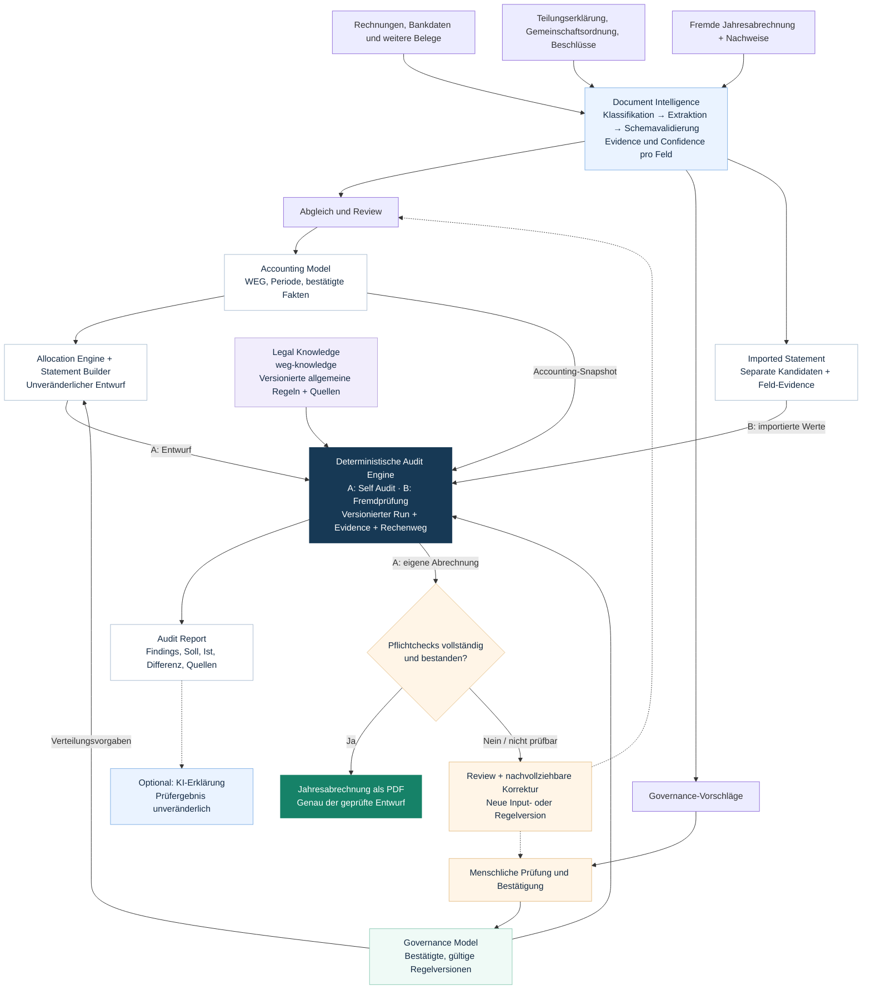

# HomeAdmin24 – langfristige Zielarchitektur

Konzeptstand 2026-10-09, keine Implementierungsfreigabe. Ergänzt [Bestandsaufnahme](accounting-audit-current-state.md), [ADRs](adr/README.md) und [Implementierungsplan](accounting-audit-phase-1-2-plan.md).

[Zeichnung als skalierbare SVG öffnen](accounting-audit-target.svg).

Die beiden Workflows nutzen dieselben Prüfverträge. Beim Erstellen erzeugt der Statement Builder zunächst einen unveränderlichen Entwurf. Der Self Audit prüft genau diesen Entwurf; erst nach erfolgreicher Freigabeprüfung wird daraus die Jahresabrechnung als PDF. Bei fremden Abrechnungen prüft die Engine ein separates Kandidatenmodell, ohne dessen Werte automatisch in die eigene Buchhaltung zu übernehmen.

Governance entsteht aus WEG-Dokumenten und menschlicher Bestätigung. Allgemeines Rechtswissen kommt aus einem fest versionierten `weg-knowledge`-Release. Diese Modelle entstehen nicht aus dem Accounting Model. Bestätigte Governance steuert sowohl die Verteilung als auch den Sollvergleich im Audit. Anwendbarkeit und Konflikte zwischen Regeln bleiben ausdrücklich zu prüfen; ein ungeklärter Pflichtcheck ist kein PASS.

## Bearbeitbare Diagrammquelle

## Leitlinien der Zeichnung

- KI liest, klassifiziert und interpretiert; strukturierte Outputs werden validiert. Unsichere Werte bleiben Vorschläge.
- Software berechnet Beträge, Verteilungen und Prüfergebnisse deterministisch. KI-Erklärungen verändern keine Findings.
- Evidence, Input-/Regelversionen und WEG-Berechtigungen gelten über alle Schritte hinweg. Nicht jede Verbindung ist zur besseren Lesbarkeit als eigene Linie gezeichnet.
- Die neue Erstellung muss zusätzlich den im Plan festgelegten lokalen Vergleich gegen die privaten 2025-HGA-Baselines bestehen. Diese Zeichnung enthält keine privaten Fixture-Daten.
- Die Darstellung beschreibt den langfristigen Ausbau des bestehenden Symfony-Monolithen, keinen vollständigen Rewrite. Vector Search und Modelltraining sind keine Voraussetzung.
